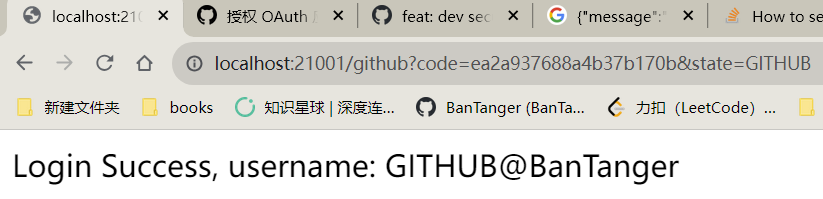
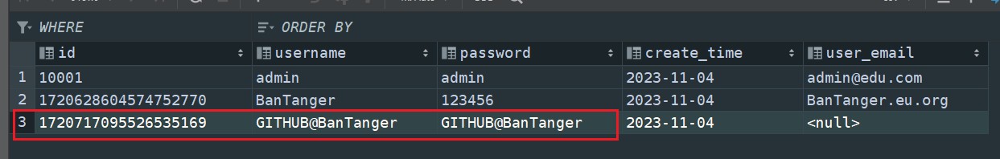

# 第三方登录的实现

参考这篇文章：

[官方文档](https://docs.github.com/zh/apps/oauth-apps/building-oauth-apps/creating-an-oauth-app)

[github第三方登录超详细流程及分析(小白笔记)](https://blog.csdn.net/qq_43516238/article/details/105884926)

[GitHub OAuth 第三方登录示例教程 - 阮一峰的网络日志](https://ruanyifeng.com/blog/2019/04/github-oauth.html)

所需要的四个键值
```yml
client_id: cf00a9382ce8110c2a70
client_secret: fd348b2050f64c7a99c07294b390a5adfaa21e8c
redirect_uri: http://localhost:21001/github
state: GITHUB
```
+ 注：为了保证安全，我的 oauth Apps 已经删掉了，想要实验的自己申请 github oauth

yml 配置
```yml
github:
  state: GITHUB
  user_prefix: ${github.state}@

  # ========= 自己申请 client_id\secret 用完之后记得删除 =========
  client_id: cf00a9382ce8110c2a70
  client_secret: fd348b2050f64c7a99c07294b390a5adfaa21e8c
  # ==========================================================

  callback: http://localhost:21001/github # github 回调 callback 会携带 code 参数
  token_url: https://github.com/login/oauth/access_token?client_id=${github.client_id}&client_secret=${github.client_secret}&redirect_uri=${github.callback}&code= # 拼接 code
  user_url: https://api.github.com/user # 使用访问令牌访问 API
```


权限访问: 

https://github.com/login/oauth/authorize?client_id=cf00a9382ce8110c2a70&redirect_uri=http://localhost:21001/github&state=GITHUB

可能会出现超时的情况


成功



数据库存在该数据

