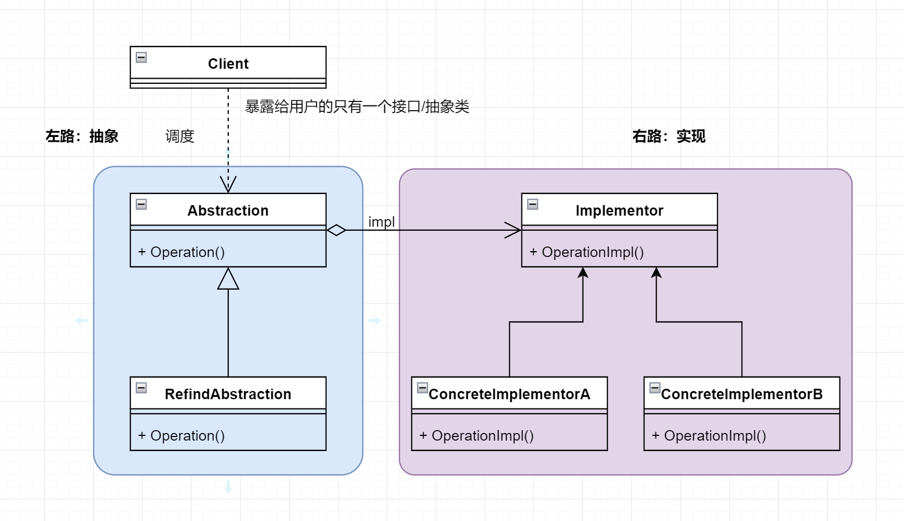

# 桥接模式（Bridge）说明

桥接模式旨在将抽象和具体实现解耦

UML 图如下

桥接一共有四个角色

分成左路和右路，左路抽象右路实现

左路是暴露给用户的抽象类和其具体抽象子类，右路是接口(也可以是抽象类)和实现它的具体子类们，中间有个桥梁连接左右两个部分

左路 Abstraction **通过构造函数的形式初始化**右路 Implementor **接口属性**，完成抽象和实现的桥梁搭建

## 右路

### Implementor 核心方法的承载接口（或抽象类）

Implementor 是实现化对象，也就是核心方法的承载角色，即：需要实现的功能，都会被 Implementor 定义方法并交由子类实现

### ConcreteImplementor 承载核心方法的具体子类

如本 demo 中的第三方登录有不同的三方，微信可以是子类，QQ 可以是子类，Github 可以是子类，以及账号密码登录也是个子类

## 左路

### Abstraction 抽象角色，暴露给用户，提供方法调用入口

从 UML 图也可以看出，Client 除了 Abstraction 之外其他所有类都不知道，这体现了设计模式六大原则中的迪米特法则

再者桥接模式的定义是抽象与实现分离，用户所知道的只有左路抽象，而右路实现并不知晓，实现了解耦

### RefinedAbstraction 抽象角色子类

本 demo 例子并不是很好，并没有很好的体现抽象子类的作用，

可以思考思考第三方支付逻辑，微信可以支付，支付宝也可以支付，而他们两个属于不同的平台被我们用户调用，从理性角度而言这不就是桥接模式的左路抽象吗

## 感悟：

桥接在第三方登录并不是一个很好的方式, 因为难以拆分出职责，第三方登录，说到底，就只有个登录逻辑拆分不出其他的职责了，

就是说，哪怕把登录方式放在左路，右路的实现也就一个登陆方式的具体实现，没法体现桥接模式的精妙之处

所以引入桥接倒是复杂了，不过写这个 demo 的目的还是为了实践一些工程能力，例如一开始想用枚举做各种登录模式子类的单例，但后面发现不太好写

又比如 Spring 并不把 Abstract 抽象类看作是实例对象，无法在 Abstract 层注入 IoC 容器, 本想用子类构造函数延迟初始化这种方式，但发现又有一点坑

如：如果要通过 new 的方式来创建子类对象，实例化对象的时候也没法填写参数，只能老老实实的交由 Spring 托管

---

我个人觉得像是第三方支付 _微信、支付宝、银行卡_ 适合做 左路的 RefinedAbstraction 

支付方式 _指纹、人脸、扫码_ 适合做 右路的 ConcreteImplementor