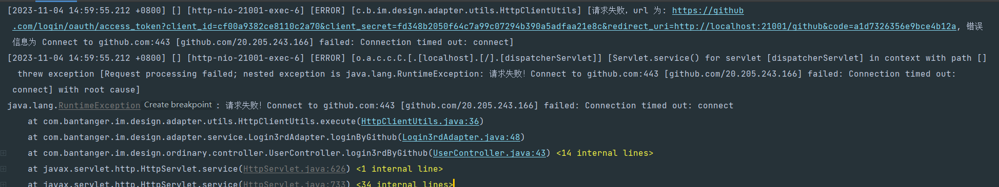

# 第三方登录的实现

参考这篇文章：

[官方文档](https://docs.github.com/zh/apps/oauth-apps/building-oauth-apps/creating-an-oauth-app)

[github第三方登录超详细流程及分析(小白笔记)](https://blog.csdn.net/qq_43516238/article/details/105884926)

[GitHub OAuth 第三方登录示例教程 - 阮一峰的网络日志](https://ruanyifeng.com/blog/2019/04/github-oauth.html)

```yml
client_id: cf00a9382ce8110c2a70
client_secret: fd348b2050f64c7a99c07294b390a5adfaa21e8c
redirect_uri: http://localhost:21001/github
```

导入依赖
```xml
<dependency>
    <groupId>org.springframework.boot</groupId>
    <artifactId>spring-boot-starter-oauth2-client</artifactId>
</dependency>
```

yml 配置
```yml
spring:
  security:
    oauth2:
      client:
        registration:
          github:
            clientId: ****************
            clientSecret: ****************
```


权限访问: 
https://github.com/login/oauth/authorize?client_id=cf00a9382ce8110c2a70&redirect_uri=http://localhost:21001/github&state=GITHUB

可能会出现超时的情况
